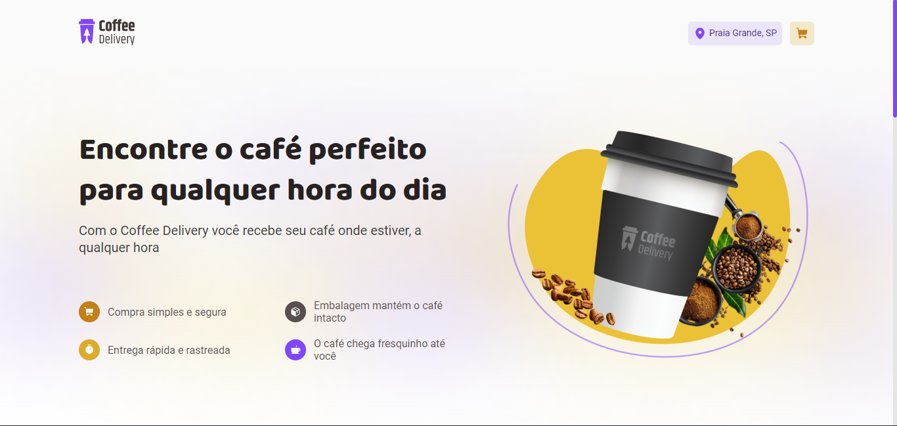

<p align="center">
  
</p>

# **💻** Projeto

Quem, como desenvolvedor - nunca teve (ou pelo menos tentou) criar um e-commerce? 

Hoje, com o crescimento da internet, a loja que não está no digital praticamente não existe no mundo real. 

Como desenvolvedor, uma das maiores demanda é a criação de e-commerce e, a fim consolidar meus conhecimentos sendo alinhado com as novas e melhores práticas e tecnologias disponíveis no mundo da tecnologia, durante o programa de aceleração “Ignite - ReactJS”, promovido pela Rocketseat, desenvolvi como desafio para consolidade meus conhecimentos adquidos uma aplicação Frontend de carrinho de compras de café, contendo página de opções e seleção de pedidos, página de finalização do pedido e informações de entrega.

Utilizei como tecnologia Vite, ReactJS, ContextAPI, React Hooks, Styled Components, Zod, React Hook Form, etc.

<p align="center">
  
</p>

## 🚀 Tecnologias utilizadas

Esse projeto foi desenvolvido com as seguintes tecnologias:

- [Vite](https://vitejs.dev/)
- [ReactJS](https://reactjs.org/)
- [TypeScript](https://www.typescriptlang.org/)
- [Styled Components](https://styled-components.com/docs)
- [Phosphor Icons](https://phosphoricons.com/)
- [React Hook Form](https://react-hook-form.com/)
- [Zod](https://github.com/colinhacks/zod)
- [React Router](https://reactrouter.com/en/v6.3.0/getting-started/overview)
- [Immer](https://github.com/immerjs/immer)
- [Polished](https://polished.js.org/)

## **🔖** Layout desenvolvido

Você pode visualizar o layout e o deploy do projeto através do link abaixo:

- [Figma](https://www.figma.com/file/4146qux6jUt4DK831vc4DO/Coffee-Delivery-(Copy)?node-id=0%3A1&t=k8XDjcxyA4daNXLv-1)
- [Deploy](https://coffee-delivery-self.vercel.app/)

Lembrando, para visualizar o layout do figma, que você precisa ter uma conta no [Figma](http://figma.com/).

## **🚀** Como Executar

Antes de baixar o projeto você vai precisar ter instalado na sua máquina as seguintes ferramentas:

- [Git](https://git-scm.com/)
- [NodeJS](https://nodejs.org/en/)
- [Yarn](https://yarnpkg.com/) ou [NPM](https://www.npmjs.com/)

Segue os comandos para baixar e executar o projeto na sua máquina:

```bash
## Clone o projeto em sua máquina
git clone https://github.com/srsouzaj/coffee-delivery.git

# Acessar o projeto no terminal
$ cd coffee-delivery

# Instalar as dependências
$ npm install

# Executar o servidor em modo de desenvolvimento
$ npm run dev
```

## 📝 License

Esse projeto está sob a licença MIT. Veja o arquivo [LICENSE](https://github.com/srsouzaj/coffee-delivery/blob/master/LICENSE) para mais detalhes.

Feito com ❤️ por Jorge de Souza
